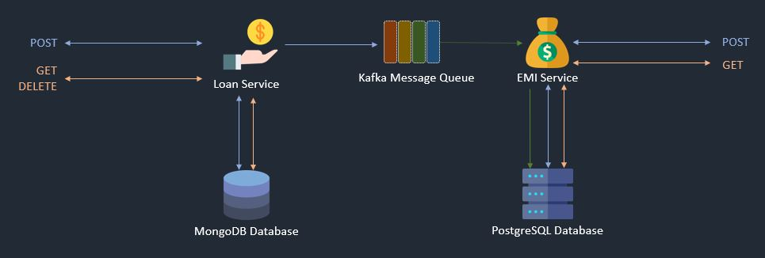

# TCS DAP 4.0 Final Project (API Stream)  

## Data Flow Diagram  

## Project Structure
- `docker-compose.yaml` contains necessary details to bring up zookeeper, kafka, mongo db & postgres databases as docker containers
- `loan-service` contains code to create loan service RESTful APIs
- `emi-service` contains code to create emi service RESTfil APIs

## Run project Locally
- `Prerequisite : ` Docker should be installed
- `docker-compose up -d`
- Loan Service APIs should be avaialble at : `http://localhost:9000/<get endpoints from loan-service/loan-service-swagger.yaml>`
- EMI Service APIs should be avaialble at : `http://localhost:9010/<get endpoints from emi-service/emi-service-swagger.yaml>`
