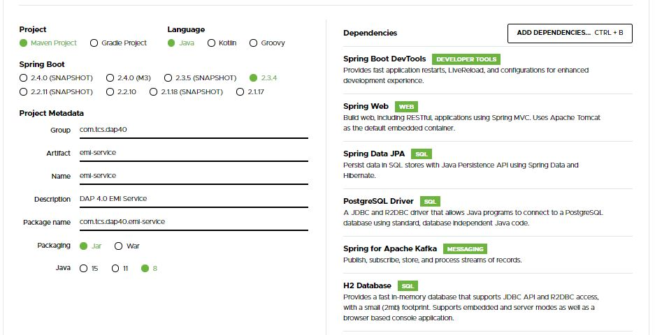

# EMI Service

## Features
1. Created using Spring Boot
2. Saves Loan details as it gets saved in Loan Service (communicated via Kafka messaging)
3. Allows submission of EMIs
4. Allows retrieval of next EMI Amount and the remaining balance
5. Saves EMI details in PostGreSQL DB

## Spring Boot Initializer for the project

## Creating Docker Image
- `docker build -t emi-service:latest .`