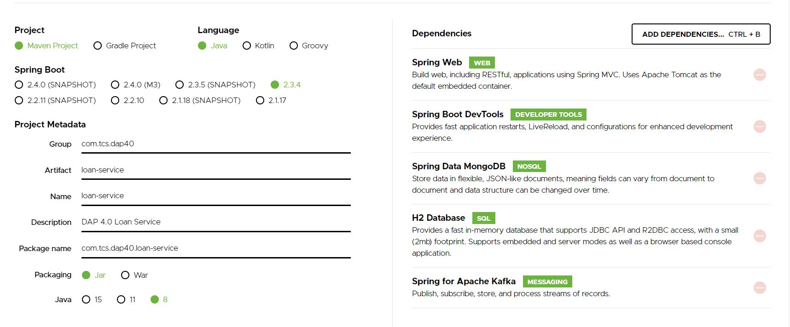

# Loan Service

## Features
1. Created using Spring Boot
2. Allows submission of a Loan object, retrieval of all loans & a single loan and deletion of existing loans
3. Saves loan details in Mongo DB
4. Sends loan details as notification in Kafka when a new loan is created

## Spring Boot Initializer for the project
